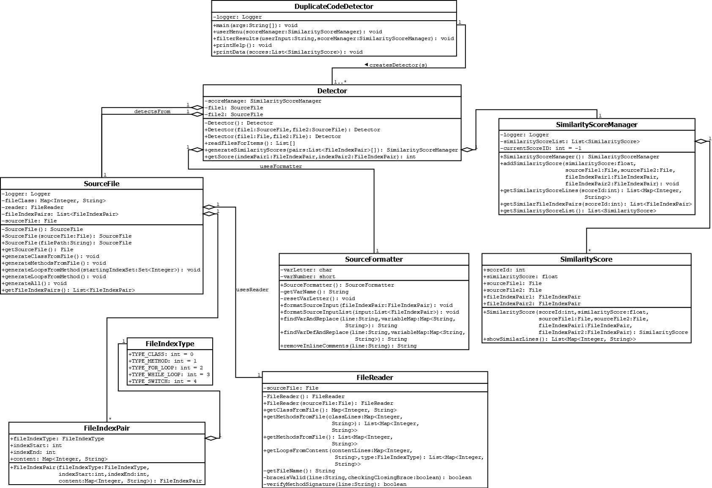

# Duplicate Code Detector App
Project for Software Engineering I.  

Team:
- Leader: Mitchell Ludolf
- Programmer: Joshua Ibrom (sk3p7ic)

---

## Class Diagram

Here's a semi-recent class diagram:  

## Tasks:

### Detector / Analyzer

- [ ] Scan the file(s) and determine where blocks of code exist.  
    - [X] Methods  
    - [X] For Loops  
    - [X] While Loops  
    - [ ] Switch Statements  
    - [ ] If / Else if / Else Statements  
- [ ] Attempt to gather which code statements are identical to each other by reading line-by-line the block(s) of code
      and attempting to use variables in those blocks to determine the context / use of the block(s) that is / are being
      analyzed.
    - *Note: A better solution than line-by-line reading is planned to be implemented.*
- [ ] Generate a similarity score, `Similarity Score = (Number of Similar Code Statements)/(Number of Code Statements)`.
      
### Display

- [ ] If the Detector is being run as a console application, display a table to the user containing the location of the
      duplicate blocks of code as well as their Similarity Scores. The table will be sorted by the Similarity Scores in
      descending order.    
- [ ] If the Detector is being run with a GUI, display the table in a manner like that described in 3.1 and allow each
      entry in the table to be clicked on to “dig” into the similar blocks of code.

## Misc. ToDo:

- `tech.sk3p7ic.detector`:
    - `detection.SourceFormatter`
        - [ ] Allow for "//" in strings to not be counted as a comment.
    - `Detector`
        - [ ] Generate similarity scores.
